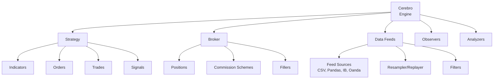

# Backtrader

**Full-featured backtesting framework with live trading support**

- **Repository**: [github.com/mementum/backtrader](https://github.com/mementum/backtrader)
- **Documentation**: [backtrader.com](https://www.backtrader.com/)
- **License**: GPL v3
- **Language**: Python
- **Author**: Daniel Rodriguez

## Overview

Backtrader is a comprehensive Python framework for backtesting and live trading. It features a powerful "lines" abstraction for time-series data, a sophisticated event-driven architecture, built-in support for 100+ technical indicators, multiple data feed formats, analyzers, observers, position sizers, and extensible broker/store backends for live trading. Its design emphasizes flexibility through metaclass-driven configuration and a rich ecosystem of pluggable components.

## Key Features

| Category | Features |
|----------|----------|
| **Strategy** | Event-driven `__init__`/`next` pattern, pre-next warmup, `next_open` for cheat-on-open |
| **Data Feeds** | CSV, pandas, Yahoo, Interactive Brokers, Oanda, VisualChart, generic CSV, replay, resampling |
| **Order Types** | Market, Close, Limit, Stop, StopLimit, StopTrail, StopTrailLimit, Historical, OCO, bracket orders |
| **Indicators** | 100+ built-in (SMA, EMA, RSI, MACD, Bollinger, ATR, etc.), TA-Lib integration, custom indicators |
| **Analyzers** | Sharpe ratio, drawdown, trade analysis, returns, VWR, time return, sqn, and custom analyzers |
| **Observers** | Broker (cash/value), BuySell markers, Trades P&L, drawdown, benchmark |
| **Sizers** | Fixed size, percent of equity, all-in, and custom position sizers |
| **Live Trading** | Interactive Brokers, Oanda, VisualChart backends via store architecture |
| **Optimization** | Multi-core parallel optimization via `cerebro.optstrategy()` with `optdatas` and `optreturn` optimizations |
| **Plotting** | Matplotlib-based with automatic indicator subplot management |

## Quick Start

Run an SMA crossover strategy with inline data -- no external files or API keys required:

```python
import datetime
import pandas as pd
import numpy as np
import backtrader as bt

# Generate inline OHLCV data
np.random.seed(42)
dates = pd.date_range("2020-01-01", periods=200, freq="B")
close = 100 * (1 + np.random.randn(200).cumsum() * 0.01)
df = pd.DataFrame({
    "open": close * (1 + np.random.randn(200) * 0.002),
    "high": close * (1 + abs(np.random.randn(200) * 0.005)),
    "low": close * (1 - abs(np.random.randn(200) * 0.005)),
    "close": close,
    "volume": np.random.randint(1000, 10000, 200).astype(float),
}, index=dates)

class SmaCross(bt.Strategy):
    params = (("fast", 10), ("slow", 30),)
    def __init__(self):
        sma_fast = bt.ind.SMA(self.data.close, period=self.p.fast)
        sma_slow = bt.ind.SMA(self.data.close, period=self.p.slow)
        self.crossover = bt.ind.CrossOver(sma_fast, sma_slow)
    def next(self):
        if self.crossover > 0:
            self.buy()
        elif self.crossover < 0:
            self.close()

cerebro = bt.Cerebro()
data = bt.feeds.PandasData(dataname=df)
cerebro.adddata(data)
cerebro.addstrategy(SmaCross)
cerebro.broker.setcash(10000)
cerebro.broker.setcommission(commission=0.001)
results = cerebro.run()
print(f"Final Value: {cerebro.broker.getvalue():.2f}")
```

## Architecture Summary



Backtrader uses a centralized `Cerebro` engine that orchestrates all components. The "lines" system provides uniform time-series access across data feeds, indicators, and observers.

## Core Components

| Component | Source File | Description |
|-----------|------------|-------------|
| `Cerebro` | `cerebro.py` | Central engine: loads data, strategies, runs simulation or optimization |
| `Strategy` | `strategy.py` | User strategy base class with order management and notification system |
| `Order` | `order.py` | Order objects with execution types, states, and bracket support |
| `Trade` | `trade.py` | Trade tracking with P&L, commission, and history |
| `Position` | `position.py` | Position size and price tracking with update semantics |
| `BrokerBase` | `broker.py` | Abstract broker interface for backtesting and live trading |
| `BackBroker` | `brokers/` | Default backtesting broker with fill simulation |
| `DataBase` | `feed.py` | Base data feed with OHLCV lines and time management |
| `Indicator` | `indicator.py` | Base indicator with automatic period calculation |
| `Observer` | `observer.py` | Passive strategy observers (cash, value, trades) |
| `Analyzer` | `analyzer.py` | Post-run analysis tools (Sharpe, drawdown, etc.) |
| `Sizer` | `sizer.py` | Position sizing logic |
| `LineBuffer` | `linebuffer.py` | Core "lines" data structure for time-series |
| `LineSeries` | `lineseries.py` | Multi-line container with indexing |
| `MetaParams` | `metabase.py` | Metaclass for declarative parameter definition |

## Documentation

- [Architecture](architecture.md) -- System design, lines system, component interactions
- [Workflow](workflow.md) -- Backtesting pipeline, strategy execution, optimization
- [State Management](state-management.md) -- Order state machine, trade lifecycle, position tracking
- [Development](development.md) -- Setup, strategy creation, custom indicators, data feeds
