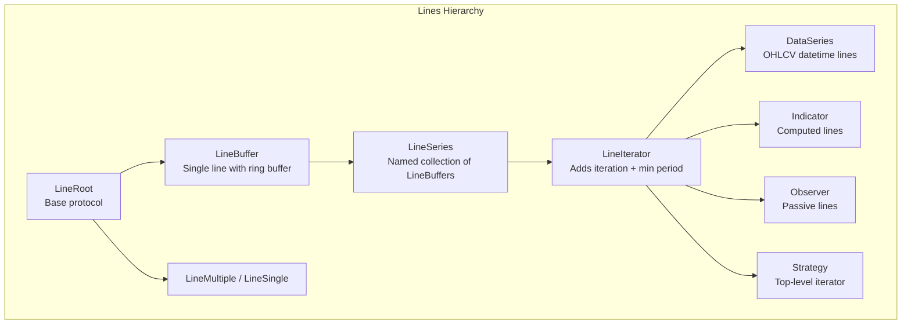
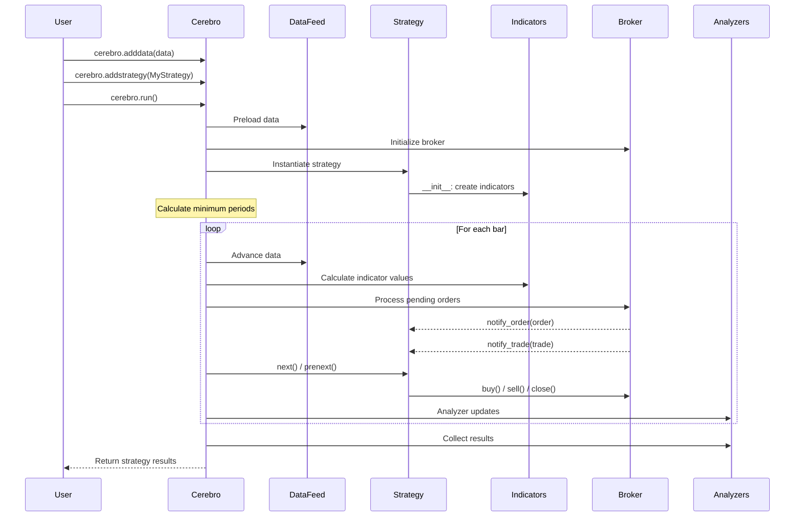
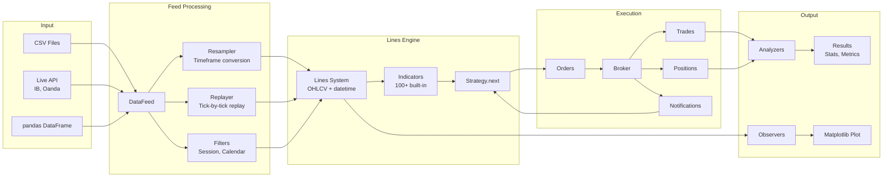

# Backtrader -- Architecture

## System Architecture

```mermaid
graph TB
    subgraph Cerebro Engine
        CE[Cerebro]
        CE --> PRELOAD[Data Preloading]
        CE --> RUNONCE[Vectorized Indicator Calc]
        CE --> EVENTLOOP[Event Loop]
        CE --> OPTIM[Optimization Engine]
    end

    subgraph Data Layer
        DF[DataFeed Base]
        DF --> CSV[CSVDataBase]
        DF --> PD[PandasData]
        DF --> IB[IBData]
        DF --> OA[OandaData]
        DF --> GEN[GenericCSVData]
        RESAMP[Resampler] --> DF
        REPLAY[Replayer] --> DF
        FILTER[Filters] --> DF
    end

    subgraph Lines System
        LB[LineBuffer<br/>Single time-series]
        LS[LineSeries<br/>Multi-line container]
        LI[LineIterator<br/>Iteration protocol]
        DS[DataSeries<br/>OHLCV + datetime lines]
        LB --> LS
        LS --> LI
        LI --> DS
    end

    subgraph Strategy Layer
        STR[Strategy]
        STR --> IND[Indicators]
        STR --> NOTIFY[Notifications<br/>order, trade, data, store]
        STR --> SIZING[Sizer]
        IND --> BUILTIN[100+ Built-in<br/>SMA, EMA, RSI, MACD...]
        IND --> TALIB[TA-Lib Bridge]
        IND --> CUSTOM[Custom Indicators]
    end

    subgraph Broker Layer
        BRK[BrokerBase]
        BRK --> BACK[BackBroker<br/>Backtesting]
        BRK --> IBBRK[IBBroker<br/>Interactive Brokers]
        BRK --> OABRK[OandaBroker<br/>Oanda]
        BRK --> COMMINFO[CommissionInfo]
        BRK --> FILLER[Fillers<br/>Volume, Bar]
    end

    subgraph Order System
        ORD[Order]
        ORD --> ORDDATA[OrderData<br/>Creation + Execution bits]
        ORD --> BRACKET[Bracket Orders<br/>Parent + SL + TP]
        ORD --> OCO[OCO Orders]
        ORD --> TRAIL[Trailing Stops]
    end

    subgraph Analysis
        OBS[Observers<br/>Cash, Value, BuySell, Trades]
        ANA[Analyzers<br/>Sharpe, DrawDown, TradeAnalyzer]
        WRT[Writers<br/>CSV output]
    end

    CE --> DF
    CE --> STR
    CE --> BRK
    CE --> OBS
    CE --> ANA
    CE --> WRT
    STR --> ORD
    DS --> STR
```



## Trading Paradigm & Key Features

| Feature | Support | Details |
|---------|---------|---------|
| Backtesting Approach | Event-driven | Bar-by-bar event loop with optional vectorized indicator precomputation (`runonce=True`) |
| Live Trading | Yes | Interactive Brokers (`IBBroker`) and Oanda (`OandaBroker`) via store architecture |
| Paper Trading | Yes | IB paper trading via TWS paper account; BackBroker simulates fills locally |
| Multi-Asset | Yes | Multiple data feeds synchronized by date; supports equities, forex, futures, CFDs |
| Data Feeds | CSV, pandas, Yahoo Finance, IB, Oanda | Extensible feed architecture with resampling and replaying support |
| ML Integration | No | No built-in ML; custom indicators can wrap external ML predictions |
| Risk Management | Built-in | Bracket orders (SL/TP), trailing stops, position sizers, commission schemes, margin |
| Optimization | Yes | Grid-search via `optstrategy()` with multiprocessing; `optreturn` for lightweight results |
| Execution | Both | Simulated (`BackBroker`) and live (`IBBroker`, `OandaBroker`) with fill simulation (volume/bar fillers) |

## Core Components Breakdown

### The Lines System

Backtrader's most distinctive architectural feature is the "lines" system -- a unified abstraction for time-series data:



**Key concepts:**
- A **line** is a single time-series (e.g., Close prices). Accessed via `self.data.close` or `self.data.lines.close`.
- Lines support negative indexing: `self.data.close[0]` is the current value, `self.data.close[-1]` is the previous bar.
- **Minimum period** is automatically calculated from indicator dependencies, ensuring `next()` is only called when sufficient data exists.

### Cerebro (`cerebro.py`)

The central orchestrator that:
1. Manages data feeds, strategies, brokers, observers, analyzers, and writers
2. Supports two execution modes:
   - **`runonce=True`** (default): Vectorized indicator calculation for speed
   - **`runonce=False`**: Pure event-driven, bar-by-bar processing (required for live)
3. Handles optimization via `optstrategy()` with multiprocessing
4. Configures `preload`, `exactbars` memory management, `live` mode, `cheat_on_open`

### Strategy (`strategy.py`)

User strategies extend `Strategy` and implement:
- **`__init__()`**: Declare indicators (auto-registered via metaclass)
- **`next()`**: Per-bar trading logic (called when all indicators have sufficient data)
- **`prenext()`**: Called during warmup period
- **`nextstart()`**: Called once on the first bar where `next()` would be called
- **Notifications**: `notify_order()`, `notify_trade()`, `notify_data()`, `notify_store()`

### Broker (`broker.py`, `brokers/`)

Abstract `BrokerBase` with concrete implementations:
- **`BackBroker`**: Backtesting broker with fill simulation, margin, commission, slippage, and volume-based filling
- **`IBBroker`**: Interactive Brokers live/paper trading
- **`OandaBroker`**: Oanda forex live trading

### MetaParams System (`metabase.py`)

Backtrader uses metaclasses for declarative parameter definition:

```python
class MyStrategy(bt.Strategy):
    params = (
        ('period', 20),
        ('multiplier', 2.0),
    )

    def __init__(self):
        self.sma = bt.ind.SMA(period=self.p.period)
```

Parameters are inherited, can be overridden, and are used in optimization.

## Component Interaction Diagram



## Data Flow Diagram



## Memory Management

Backtrader offers three memory modes via `cerebro.run(exactbars=...)`:

| Mode | Value | Description |
|------|-------|-------------|
| **Full** | `False` (default) | All data kept in memory |
| **Minimal** | `True` or `1` | Ring buffers sized to minimum period. Disables plotting and preload. |
| **Intermediate** | `-1` | Strategy-level data/indicators kept fully; sub-indicators use minimal buffers |
| **Selective** | `-2` | Only strategy attributes kept fully; sub-indicators and unnamed operations use minimal |

---
## See Also
- [README](README.md) — Project overview and quick start
- [Workflow](workflow.md) — Event flows and processing pipelines
- [State Management](state-management.md) — State lifecycle and data models
- [Development](development.md) — Development guide and best practices
