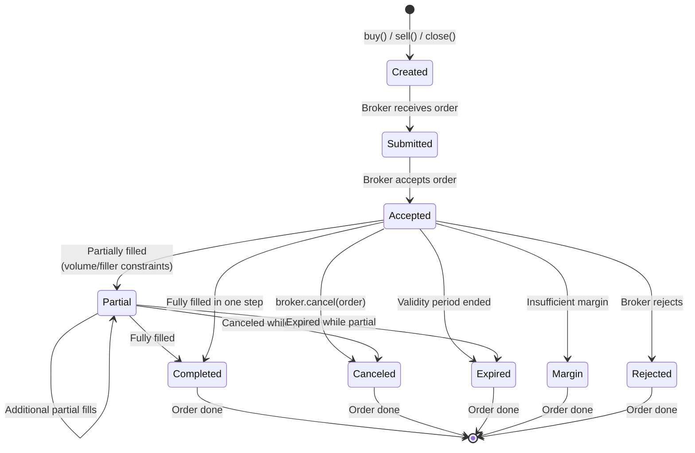
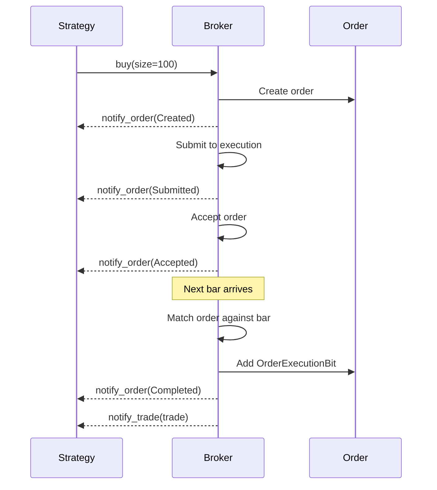
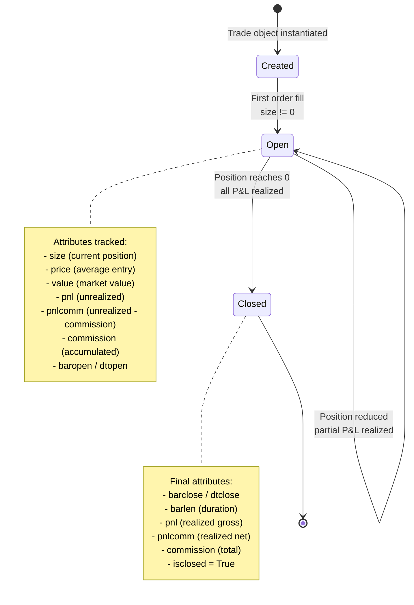
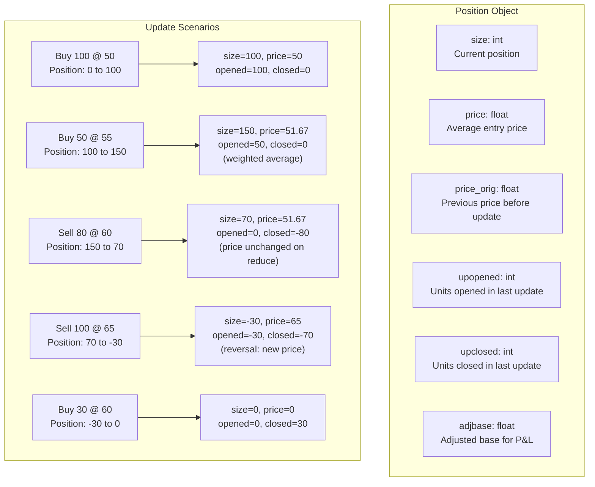
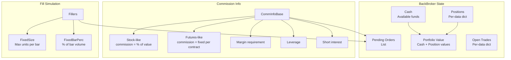
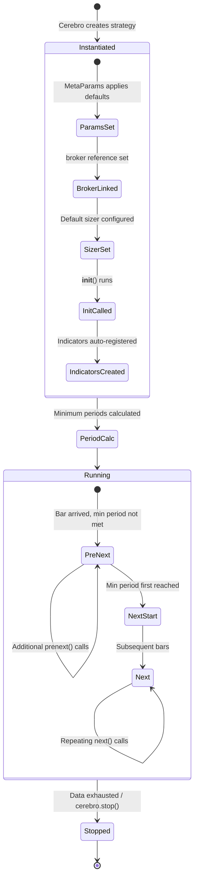
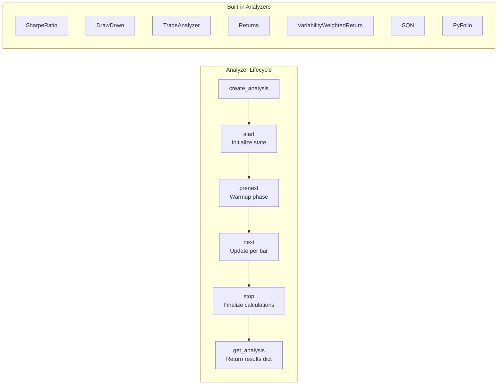
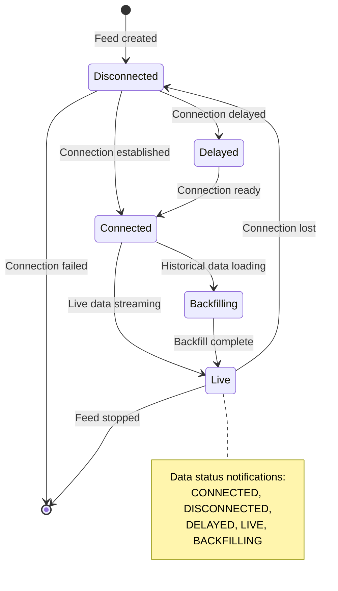

# Backtrader -- State Management

## Order State Machine



### Order Status Codes

| Status | Value | Description |
|--------|-------|-------------|
| `Created` | 0 | Order created by strategy |
| `Submitted` | 1 | Order submitted to broker |
| `Accepted` | 2 | Broker accepted the order |
| `Partial` | 3 | Order partially filled |
| `Completed` | 4 | Order fully filled |
| `Canceled` | 5 | Order canceled (also `Cancelled`) |
| `Expired` | 6 | Order expired (validity ended) |
| `Margin` | 7 | Insufficient margin |
| `Rejected` | 8 | Broker rejected the order |

### Order Execution Types

| Type | Value | Description |
|------|-------|-------------|
| `Market` | 0 | Fill at next bar's open |
| `Close` | 1 | Fill at current bar's close |
| `Limit` | 2 | Fill at limit price or better |
| `Stop` | 3 | Trigger at stop price, then market fill |
| `StopLimit` | 4 | Trigger at stop, then limit order |
| `StopTrail` | 5 | Trailing stop with absolute amount |
| `StopTrailLimit` | 6 | Trailing stop with limit |
| `Historical` | 7 | Historical order replay |

### Order Notification Flow



## Trade Lifecycle



### Trade States

| State | Value | Description |
|-------|-------|-------------|
| `Created` | 0 | Trade object created |
| `Open` | 1 | Trade has non-zero position |
| `Closed` | 2 | Trade position returned to zero |

### Trade History

Each trade maintains a history list of `TradeHistory` entries. Each entry records:
- **status**: dt, barlen, size, price, value, pnl, pnlcomm
- **event**: order reference, size delta, fill price, commission

```python
# Accessing trade history
def notify_trade(self, trade):
    if trade.isclosed:
        for h in trade.history:
            print(f"  {h.status.dt}: size={h.status.size} pnl={h.status.pnl}")
```

## Position Tracking



### Position Update Semantics

The Position class follows specific rules for price averaging:

| Scenario | Size Change | Price Behavior |
|----------|-------------|----------------|
| **Open from zero** | 0 to N | Price = fill price |
| **Increase** | Same direction | Price = weighted average |
| **Reduce** | Opposite, partial | Price unchanged (FIFO) |
| **Close** | To zero | Price = 0 |
| **Reverse** | Through zero | Price = fill price (new direction) |

## Broker State Management



### Broker Cash Flow

```
Starting Cash
  + Closed position P&L
  - Commission on trades
  - Margin requirements (locked)
  - Interest on short positions
  = Current Cash

Portfolio Value = Cash + sum(position.size * current_price) for all positions
```

## Strategy Lifecycle States



## Analyzer State

Analyzers maintain state across the entire backtest:



## Observer State

Observers are passive monitors that record data into lines for plotting:

| Observer | Lines | Description |
|----------|-------|-------------|
| `Broker` | cash, value | Portfolio cash and total value |
| `BuySell` | buy, sell | Buy/sell signal markers |
| `Trades` | pnlplus, pnlminus | Profit/loss per trade |
| `DrawDown` | drawdown, maxdrawdown | Current and max drawdown |
| `Benchmark` | benchmark | Benchmark comparison line |

## Data Feed States



---
## See Also
- [README](README.md) — Project overview and quick start
- [Architecture](architecture.md) — System design and components
- [Workflow](workflow.md) — Event flows and processing pipelines
- [Development](development.md) — Development guide and best practices
