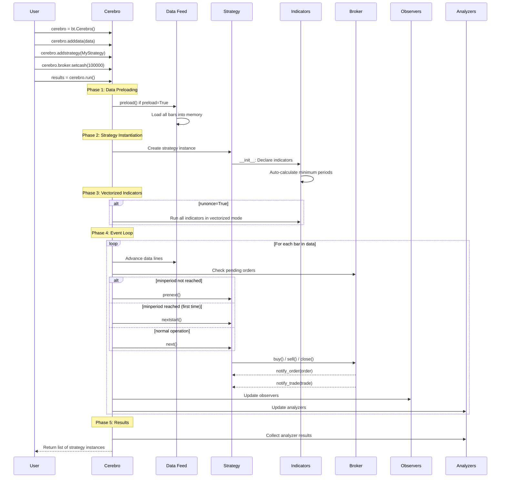
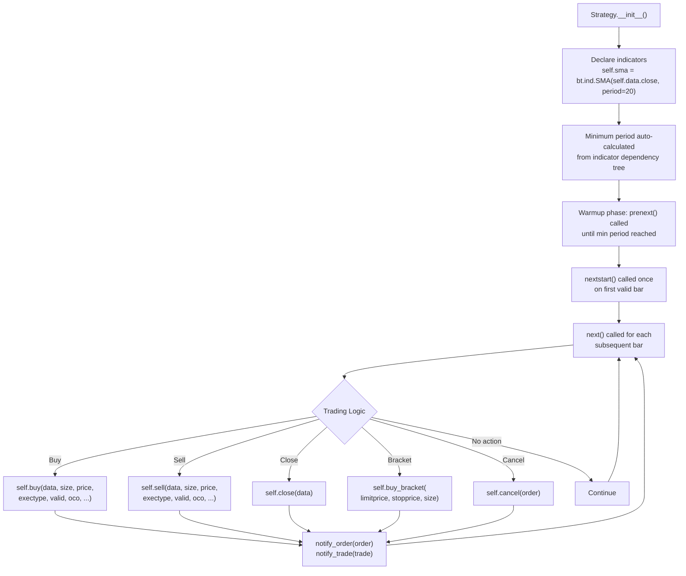
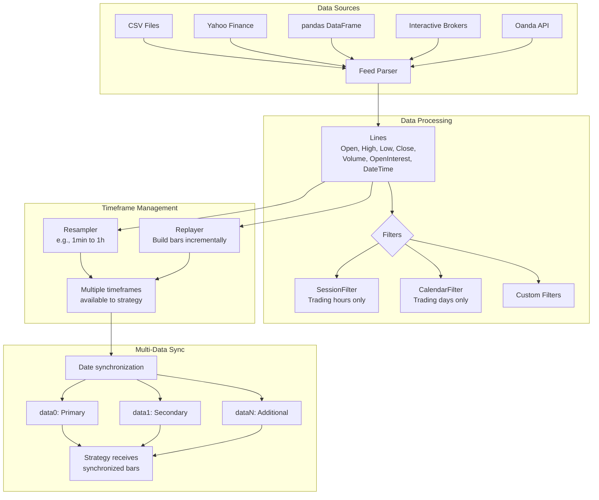
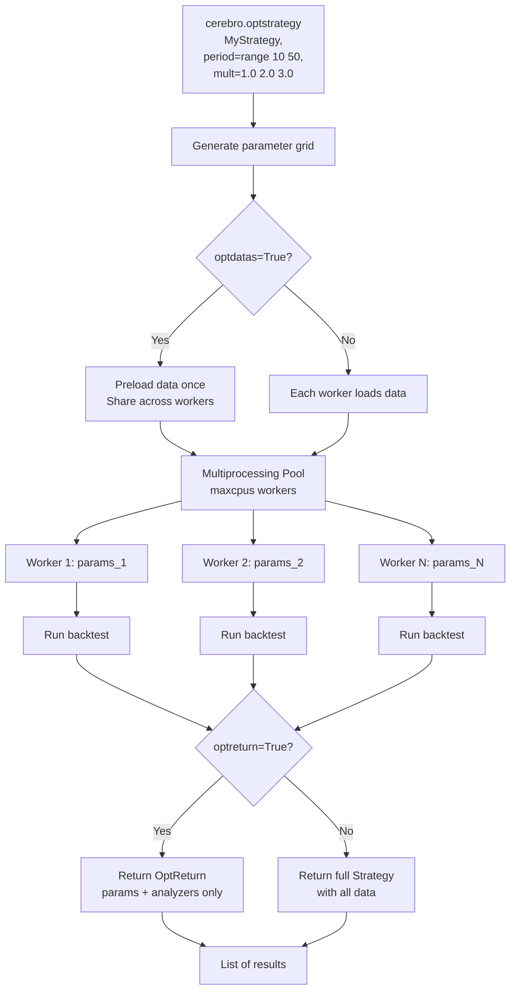
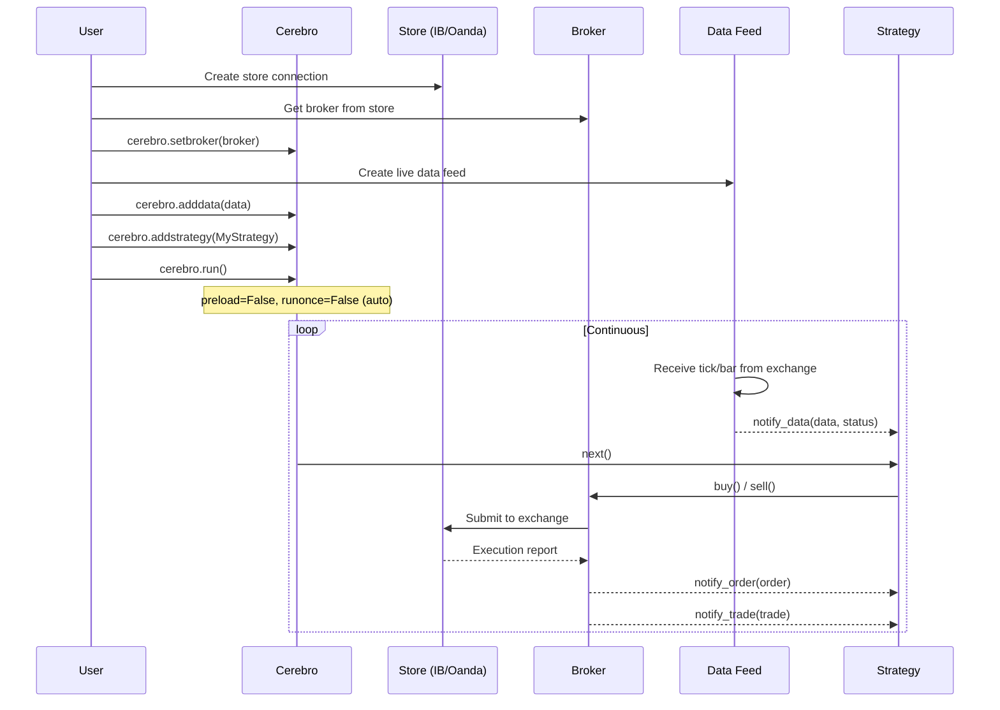
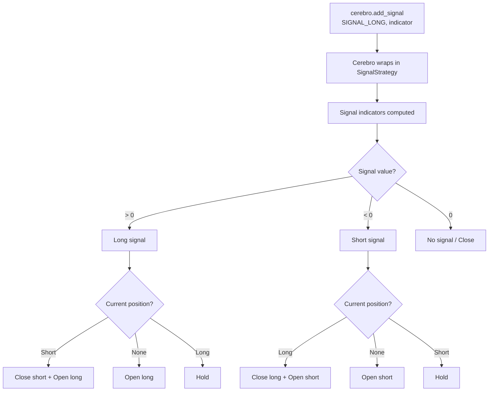

# Backtrader -- Workflow

## Backtesting Pipeline



## Strategy Execution Flow



## Order Processing Flow

```mermaid
flowchart TD
    subgraph Order Submission
        CREATE[Strategy: buy/sell/close] --> SIZER[Sizer calculates size]
        SIZER --> SUBMIT[Broker.submit order]
        SUBMIT --> QUEUE[Order queue<br/>Status: Submitted]
    end

    subgraph Order Matching (BackBroker)
        QUEUE --> ACCEPT[Status: Accepted]
        ACCEPT --> MATCH{Match against bar}

        MATCH --> MKT{Market Order}
        MKT --> FILL_OPEN[Fill at Open price]

        MATCH --> CLOSE_ORD{Close Order}
        CLOSE_ORD --> FILL_CLOSE[Fill at Close price]

        MATCH --> LMT{Limit Order}
        LMT --> LMT_CHK{Price within<br/>High/Low range?}
        LMT_CHK -->|Yes| FILL_LMT[Fill at limit price]
        LMT_CHK -->|No| PENDING[Remain pending]

        MATCH --> STP{Stop Order}
        STP --> STP_CHK{Stop triggered?}
        STP_CHK -->|Yes| FILL_STP[Fill at stop price]
        STP_CHK -->|No| PENDING

        MATCH --> STPLMT{StopLimit}
        STPLMT --> STPLMT_CHK{Stop triggered?}
        STPLMT_CHK -->|Yes| CONVERT[Convert to Limit]
        STPLMT_CHK -->|No| PENDING
        CONVERT --> LMT_CHK

        MATCH --> TRAIL{StopTrail}
        TRAIL --> TRAIL_UPD[Update trail price<br/>based on High/Low]
        TRAIL_UPD --> TRAIL_CHK{Trail hit?}
        TRAIL_CHK -->|Yes| FILL_TRAIL[Fill at trail price]
        TRAIL_CHK -->|No| PENDING
    end

    subgraph Fill Processing
        FILL_OPEN --> EXEC[Create OrderExecutionBit]
        FILL_CLOSE --> EXEC
        FILL_LMT --> EXEC
        FILL_STP --> EXEC
        FILL_TRAIL --> EXEC

        EXEC --> PARTIAL{Fully filled?}
        PARTIAL -->|Partial| PART_STATUS[Status: Partial]
        PARTIAL -->|Full| COMP_STATUS[Status: Completed]

        PART_STATUS --> POSITION[Update Position]
        COMP_STATUS --> POSITION
        POSITION --> TRADE[Update Trade<br/>P&L, Commission]
        TRADE --> STRATEGY_NOTIFY[notify_order + notify_trade]
    end

    PENDING --> VALID{Order valid?<br/>Expiry check}
    VALID -->|Expired| EXPIRED[Status: Expired]
    VALID -->|Valid| QUEUE
```

## Data Feed Handling



### Multi-Timeframe Example

```python
cerebro = bt.Cerebro()

# Add primary 1-minute data
data0 = bt.feeds.GenericCSVData(dataname='data_1min.csv')
cerebro.adddata(data0)

# Resample to 15-minute
data1 = cerebro.resampledata(data0, timeframe=bt.TimeFrame.Minutes, compression=15)

# In strategy: self.data0 (1min), self.data1 (15min)
```

## Optimization Flow



### Optimization Example

```python
cerebro = bt.Cerebro()
cerebro.adddata(data)

cerebro.optstrategy(
    MyStrategy,
    period=range(10, 50, 5),
    multiplier=[1.0, 1.5, 2.0, 2.5]
)

cerebro.addanalyzer(bt.analyzers.SharpeRatio)
results = cerebro.run(maxcpus=4)

# Results is a list of lists (one per parameter combination)
for result in results:
    strat = result[0]
    sharpe = strat.analyzers.sharperatio.get_analysis()
    print(f'Params: {strat.params.__dict__}, Sharpe: {sharpe}')
```

## Live Trading Flow



## Signal-Based Strategy Flow



---
## See Also
- [README](README.md) — Project overview and quick start
- [Architecture](architecture.md) — System design and components
- [State Management](state-management.md) — State lifecycle and data models
- [Development](development.md) — Development guide and best practices
